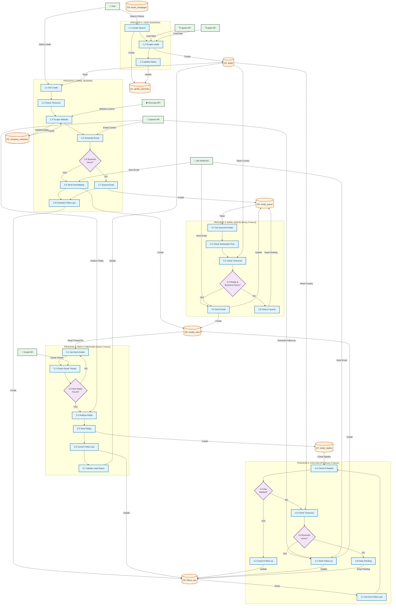

# Corofy Lead Scraping & Email Automation System - Mermaid Diagram

## Complete System Flow

### Process 1: Lead Scraping
- User creates search → Stores in `apollo_searches`
- Scrapes leads from Apollo/Apify → Stores in `leads`
- Updates search status

### Process 2: Email Sending
- Gets selected leads
- Checks timezone (business hours?)
- Scrapes website (cached or via Firecrawl)
- Generates email using OpenAI
- **Decision**: Business hours?
  - **YES** → Send immediately → Store in `emails_sent`
  - **NO** → Queue email → Store in `email_queue`
- Schedules follow-ups (5day, 10day) → Store in `follow_ups`

### Process 3: Email Queue Processing (Every 3 Hours)
- Gets pending emails from queue
- Checks scheduled time
- Checks timezone
- **Decision**: Ready & Business hours?
  - **YES** → Send email → Update queue, Store in `emails_sent`
  - **NO** → Keep in queue

### Process 4: Follow-up Processing (Every 3 Hours)
- Gets due follow-ups
- Checks if lead replied
- **Decision**: Has replied?
  - **YES** → Cancel follow-up
  - **NO** → Check timezone
    - **Decision**: Business hours?
      - **YES** → Send follow-up → Update status, Store in `emails_sent`
      - **NO** → Keep pending

### Process 5: Reply Checking (Every 2 Hours)
- Gets sent emails with thread IDs
- Checks Gmail API for new replies
- **Decision**: New reply found?
  - **YES** → Analyze reply (OpenAI) → Store in `email_replies` → Cancel follow-ups → Update lead status
  - **NO** → Continue checking

## Data Stores
- **D1**: `apollo_searches` - Search criteria
- **D2**: `leads` - All scraped leads
- **D3**: `company_websites` - Cached website content
- **D4**: `email_campaigns` - Campaign metadata
- **D5**: `email_queue` - Queued emails
- **D6**: `emails_sent` - All sent emails
- **D7**: `email_replies` - Detected replies
- **D8**: `follow_ups` - Scheduled follow-ups

## External Services
- **Apollo API** / **Apify API** - Lead scraping
- **Firecrawl API** - Website scraping
- **OpenAI API** - Email generation & reply analysis
- **Gmail API** - Reply detection
- **n8n Webhook** - Email sending (via Gmail API)

